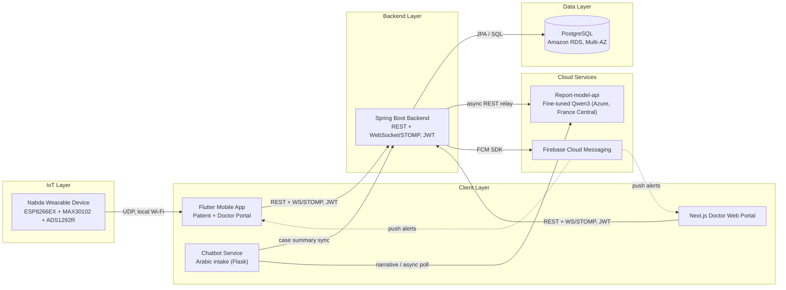
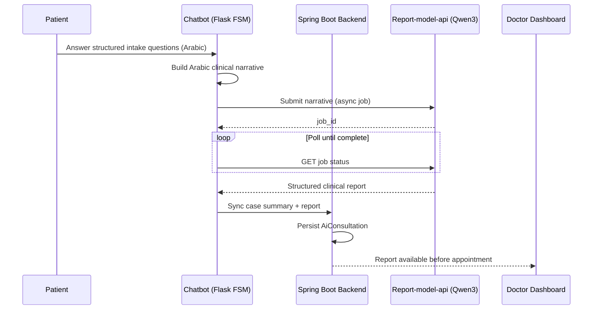
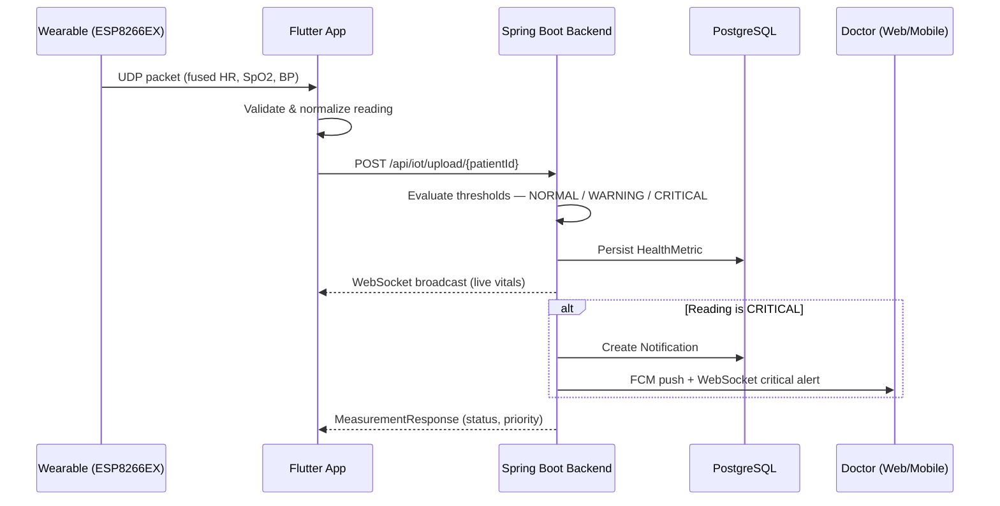
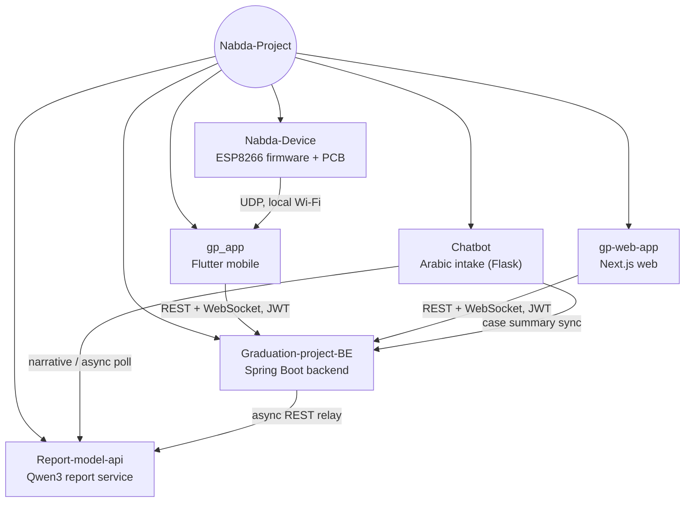

# NABDA — نبضة
### Intelligent Diagnostic Support & Follow-Up System

*A cardiovascular care ecosystem: wearable biosensing, conversational AI intake, and real-time doctor–patient follow-up.*

---

## About

**NABDA** ("pulse" in Arabic) is a graduation project from the Electronics & Communications program at Alexandria University's Faculty of Engineering. It targets a concrete problem in Egyptian healthcare: cardiac patients routinely wait 3+ hours for a consult, clinical communication is fragmented, and there is no continuous monitoring between visits.

NABDA closes that gap with four integrated pieces:

1. **An AI conversational agent** that intakes patients in dialectal Arabic before their appointment, so the doctor opens a ready-made case summary instead of starting from zero.
2. **A custom wearable device** (MAX30102 + ADS1292R on an ESP8266EX) that continuously tracks heart rate, SpO₂, and estimated blood pressure.
3. **A Spring Boot backend** that ingests vitals, evaluates them against clinical thresholds, stores the longitudinal patient record, and pushes real-time alerts.
4. **Two frontends** — a Flutter app for patients and doctors, and a Next.js web portal for doctors at a workstation — both talking to the same backend over REST and WebSocket/STOMP.

This repository (`.github`) is the organization's profile — it doesn't contain code, it explains how the six repositories below fit together.

---

## Table of Contents

- [System Architecture](#system-architecture)
- [How Data Flows](#how-data-flows)
  - [Pre-Consultation Chatbot Flow](#pre-consultation-chatbot-flow)
  - [Wearable Vitals & Alert Flow](#wearable-vitals--alert-flow)
- [Repositories](#repositories)
- [Repository Relationships](#repository-relationships)
- [Tech Stack](#tech-stack)
- [The Wearable Device](#the-wearable-device)
- [Team](#team)
- [Supervisor & Institution](#supervisor--institution)
- [Medical Disclaimer](#medical-disclaimer)
- [License](#license)

---

## System Architecture

Six subsystems communicate across REST, WebSocket/STOMP, UDP, and async job-polling channels:

**Wearable Device** — samples vitals locally, runs sensor fusion on-device, and streams a UDP packet to the paired phone. It never talks to the backend directly and holds no persistent storage.

**Flutter Mobile App** — the primary patient interface and a full doctor portal for mobile use: auth, UDP listener, vitals dashboard, chatbot UI, AI report history, real-time chat, push notifications.

**Next.js Doctor Web Portal** — the same doctor feature set, built for a workstation. It talks to the identical REST/WebSocket API as the mobile app and never touches the database directly.

**Spring Boot Backend** — the orchestrator: stateless JWT auth, vitals ingestion and threshold evaluation, multi-channel alert dispatch (in-app + FCM + WebSocket), appointment and medical-record lifecycle, and the bridge to the external AI service.

**PostgreSQL (Amazon RDS)** — the single source of truth, accessed exclusively through Spring Data JPA/Hibernate.

**Report-model-api & Firebase** — external services: a fine-tuned Qwen3-4B model that turns an Arabic narrative into a structured clinical report, and FCM for cross-platform push delivery.

---

## How Data Flows

### Pre-Consultation Chatbot Flow

### Wearable Vitals & Alert Flow

---

## Repositories

| Repository | Role | Core Tech |
|---|---|---|
| [**gp_app**](https://github.com/Nabda-Project/gp_app) | Cross-platform mobile app for patients & doctors | Flutter, Dart, Firebase, Hive |
| [**gp-web-app**](https://github.com/Nabda-Project/gp-web-app) | Doctor-only web portal | Next.js 15, React 19, TypeScript, Tailwind |
| [**Graduation-project-BE**](https://github.com/Nabda-Project/Graduation-project-BE) | Central backend: auth, vitals, alerts, chat, records | Spring Boot 3.5, Java 21, PostgreSQL, JWT |
| [**Chatbot**](https://github.com/Nabda-Project/Chatbot) | Arabic conversational pre-consultation intake | Python, Flask |
| [**Report-model-api**](https://github.com/Nabda-Project/Report-model-api) | Fine-tuned LLM clinical report generation service | FastAPI, llama.cpp, Qwen3 (GGUF), Docker |
| [**Nabda-Device**](https://github.com/Gp-team26/Nabda-Device) | Wearable firmware, sensor fusion & PCB design | ESP8266 (Arduino), Altium Designer |

---

## Repository Relationships

---

## Tech Stack

| Layer | Technologies |
|---|---|
| **Mobile** | Flutter, Dart, Hive, Flutter Secure Storage, Foreground Service (UDP listener) |
| **Web** | Next.js 15, React 19, TypeScript 5.8, Tailwind CSS, STOMP over SockJS |
| **Backend** | Spring Boot 3.5, Java 21, Spring Security (JWT), WebSocket/STOMP, MapStruct |
| **Database** | PostgreSQL 16 on Amazon RDS (Multi-AZ) |
| **AI / NLP** | Rule-based FSM chatbot, fine-tuned Qwen3-4B (GGUF via llama.cpp), JSON-schema-constrained generation |
| **Hardware** | ESP8266EX, MAX30102 (PPG), ADS1292R (ECG), custom Kalman-filter sensor fusion, Altium-designed PCB |
| **Cloud & DevOps** | AWS Elastic Beanstalk / EC2, Azure (France Central) inference, Firebase Cloud Messaging, GitHub Actions CI/CD, Docker |

---

## The Wearable Device

The Nabda wristband fuses PPG and ECG-derived signals through a custom Kalman filter, with a 3D-printed enclosure housing the PCB, LiPo battery, and sensors.

<table align="center">
  <tr>
    <td align="center" width="33%">
       
      Enclosure render
    </td>
    <td align="center" width="33%">
       
      Prototype — top view
    </td>
    <td align="center" width="33%">
       
      Prototype — bottom view
    </td>
  </tr>
  <tr>
    <td align="center">
       
      PCB 3D render — front
    </td>
    <td align="center">
       
      PCB 3D render — back
    </td>
    <td align="center">
       
      PPG schematic
    </td>
  </tr>
</table>

---

## Team

Graduation Project Team 2025/2026 — Faculty of Engineering, Electronics & Communications, Alexandria University. Six equal contributors — listed alphabetically by first name, no seniority or hierarchy implied by order or position.

> Each card below has a photo slot. Drop a real headshot into `assets/team/<file>.png` (same filename, any size — it'll be cropped square) to replace the placeholder initials.

<table align="center">
  <tr>
    <td align="center" width="16.6%">
        
      <b>Malak Essam Kamal</b> 
      <a href="https://www.linkedin.com/in/malak-essam04/">LinkedIn ↗</a>
    </td>
    <td align="center" width="16.6%">
        
      <b>Mohammad Abdul-Shafi Seddiq</b> 
      <a href="https://www.linkedin.com/in/abdulshafi/">LinkedIn ↗</a>
    </td>
    <td align="center" width="16.6%">
        
      <b>Shahd Tamer Khamis</b> 
      <a href="https://www.linkedin.com/in/shahd-tamer-1b5303244/">LinkedIn ↗</a>
    </td>
    <td align="center" width="16.6%">
        
      <b>Yehia Said Gewily</b> 
      <a href="https://www.linkedin.com/in/yehia-gewily-7545231a6/">LinkedIn ↗</a>
    </td>
    <td align="center" width="16.6%">
        
      <b>Ziad Mohammad Elsayed</b> 
      <a href="https://www.linkedin.com/in/ziadmohamedelsayed/">LinkedIn ↗</a>
    </td>
    <td align="center" width="16.6%">
        
      <b>Ziad Mostafa Zaki</b> 
      <a href="https://www.linkedin.com/in/ziad-mostafa-zaki-354952244/">LinkedIn ↗</a>
    </td>
  </tr>
</table>

---

## Supervisor & Institution

**Supervisor:** Dr. Aida El-Shafie

**Institution:** Alexandria University — Faculty of Engineering — Electrical Engineering Department, Electronics & Communications Major — Academic Year 2025/2026

---

## Medical Disclaimer

NABDA is a healthcare **support** system and a graduation-project prototype. It does not replace doctors, provide a final diagnosis, or make treatment decisions. All medical decisions must be made by qualified healthcare professionals. Clinical validation, regulatory approval, and larger-scale testing would be required before any real-world clinical use.

## License

Individual repositories are released under the MIT License unless otherwise noted in that repository. See each repo'
